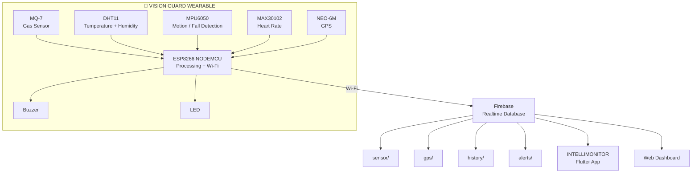
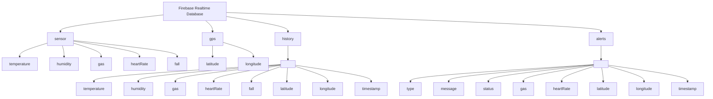

# 🦺 Vision Guard

<p align="center">
  <strong>Real-Time IoT Worker Safety Monitoring System</strong>
</p>

<p align="center">
  <em>Detect • Monitor • Alert • Locate</em>
</p>

<p align="center">


</p>

---

## 📖 Overview

**Vision Guard** is an IoT-based wearable worker-safety monitoring system designed to provide real-time information about environmental conditions, worker motion, heart rate and location.

The system uses an **ESP8266 NodeMCU** as its central controller and integrates multiple sensors:

* MQ-7 gas sensor
* DHT11 temperature/humidity sensor
* MPU6050 accelerometer/gyroscope
* MAX30102 heart-rate sensor
* NEO-6M GPS module
* Buzzer
* LED indicator

Sensor data is processed by the ESP8266 and synchronized with **Firebase Realtime Database**.

The collected information can then be consumed by monitoring interfaces such as the **INTELLIMONITOR Flutter application** and web dashboard.

The project focuses on combining multiple safety-monitoring capabilities into one relatively low-cost wearable platform.

---

# 🎯 Problem Statement

Construction environments can expose workers to several hazards, including:

* Sudden falls or impacts
* Dangerous gas exposure
* High temperatures
* Abnormal heart-rate readings
* Delayed emergency response
* Difficulty locating workers during incidents

Traditional safety monitoring can rely heavily on periodic human observation or separate devices.

Vision Guard explores a different approach:

> **Continuously collect worker and environmental data, process critical conditions locally, synchronize the information to the cloud, and make it available to supervisors in real time.**

---

# ✨ Key Features

| Feature              | Description                          |
| -------------------- | ------------------------------------ |
| 🌫️ Gas Monitoring   | MQ-7 analog gas-level monitoring     |
| 🌡️ Temperature      | DHT11 ambient temperature monitoring |
| 💧 Humidity          | DHT11 relative humidity monitoring   |
| 🧍 Fall Detection    | MPU6050 acceleration-based detection |
| ❤️ Heart Rate        | MAX30102 pulse/heart-rate monitoring |
| 📍 GPS Tracking      | NEO-6M latitude and longitude        |
| 🚨 Local Alerts      | Buzzer + LED                         |
| ☁️ Cloud Telemetry   | Firebase Realtime Database           |
| 📊 Historical Data   | Periodic sensor snapshots            |
| 🔔 Emergency Events  | Firebase alert records               |
| 📱 Mobile Monitoring | Flutter application                  |
| 🖥️ Web Monitoring   | Browser-based dashboard              |

---

# 🏗️ System Architecture

The architecture below follows the implemented ESP8266 firmware and the project proposal.



The original project proposal similarly defines the system around an ESP8266 controller, gas/temperature/motion/pulse/GPS sensors, Firebase cloud storage, web/mobile monitoring and local alerts.

---

# 🔌 Hardware Wiring

## ESP8266 Pin Mapping

The following signal connections are based on the actual firmware definitions.

| Component | Signal        | ESP8266 |
| --------- | ------------- | ------- |
| MQ-7      | Analog Output | **A0**  |
| DHT11     | DATA          | **D4**  |
| Buzzer    | Control       | **D7**  |
| LED       | Control       | **D0**  |
| NEO-6M    | TX → ESP RX   | **D6**  |
| NEO-6M    | RX ← ESP TX   | **D5**  |
| MPU6050   | SDA           | **D2**  |
| MPU6050   | SCL           | **D1**  |
| MAX30102  | SDA           | **D2**  |
| MAX30102  | SCL           | **D1**  |

---

## I²C Wiring

The firmware initializes the I²C bus using:

```cpp
Wire.begin(D2, D1);
```

Therefore:

```text
ESP8266 D2 → SDA
ESP8266 D1 → SCL
```

Both the MPU6050 and MAX30102 operate on this shared I²C bus.

```text
             ESP8266
             ┌───────┐
             │       │
       D2 ───┤ SDA   │──── MPU6050 SDA
             │       │
       D1 ───┤ SCL   │──── MPU6050 SCL
             │       │
             │       │──── MAX30102 SDA
             │       │──── MAX30102 SCL
             └───────┘
```

---

## GPS Wiring

The firmware defines:

```cpp
#define GPS_RX D6
#define GPS_TX D5
```

Therefore:

```text
NEO-6M TX ─────→ ESP8266 D6
NEO-6M RX ←───── ESP8266 D5
```

The GPS serial interface is initialized at **9600 baud**.

---

## Complete Wiring Overview

```text
                    ┌───────────────────┐
                    │    ESP8266        │
                    │                   │
MQ-7 ──────────────►│ A0                │
DHT11 ─────────────►│ D4                │
Buzzer ◄────────────│ D7                │
LED ◄───────────────│ D0                │
GPS TX ────────────►│ D6                │
GPS RX ◄────────────│ D5                │
                    │                   │
MPU6050 SDA ───────►│ D2 ─── I²C ──────┤
MPU6050 SCL ───────►│ D1                │
MAX30102 SDA ──────►│ D2                │
MAX30102 SCL ──────►│ D1                │
                    └───────────────────┘
```

> **Power note:** The exact VCC/GND arrangement should follow the electrical specifications of the specific sensor breakout boards used in the prototype. The firmware establishes the signal-pin mapping but does not define one universal power arrangement for every module.

---

# 🧩 Hardware Components

### ESP8266 NodeMCU

Acts as the central controller.

Responsibilities include:

* Reading sensors
* Processing motion data
* Calculating heart rate
* Receiving GPS data
* Evaluating safety conditions
* Activating local alerts
* Connecting to Wi-Fi
* Updating Firebase

---

### MQ-7

The MQ-7 is connected to the ESP8266 analog input:

```text
MQ-7 → A0
```

The firmware reads the analog value using:

```cpp
gasValue = analogRead(MQ7_PIN);
```

---

### DHT11

The DHT11 provides:

* Temperature
* Relative humidity

Connection:

```text
DHT11 DATA → D4
```

The firmware samples these values during its periodic sensor cycle.

---

### MPU6050

The MPU6050 provides accelerometer data used for movement and fall detection.

The firmware reads:

```text
AX
AY
AZ
```

and converts the values into acceleration in G.

The implemented fall condition is:

```text
Total acceleration > 2.5g
        ↓
Fall detected
```

This threshold is directly implemented in the firmware.

---

### MAX30102

The MAX30102 is used for heart-rate monitoring.

The firmware:

1. Reads the infrared signal.
2. Detects pulse peaks.
3. Calculates BPM.
4. Stores valid readings.
5. Maintains a rolling set of readings.
6. Calculates average BPM.

The valid BPM range used during processing is approximately:

```text
40 BPM < BPM < 180 BPM
```

The resulting average is stored as the current heart-rate value.

> **Important:** SpO₂ is not treated as an implemented application feature. The project uses the MAX30102 primarily for heart-rate monitoring.

---

### NEO-6M GPS

The GPS module provides worker-location information.

The firmware stores:

```text
Latitude
Longitude
```

and validates GPS location data before updating the current coordinates.

---

# 🚨 Safety & Alert Logic

Vision Guard uses local and cloud-based alert mechanisms.

## Local Alert

The current firmware activates the buzzer and LED when:

```text
Gas > 300
OR
Fall detected
OR
Heart Rate > 110 BPM
```

```text
             Hazard
                │
       ┌────────┼────────┐
       ▼        ▼        ▼
     Gas      Fall      HR
    >300      TRUE     >110
       │        │        │
       └────────┼────────┘
                ▼
       ┌─────────────────┐
       │ Buzzer + LED ON │
       └─────────────────┘
```

---

## Firebase Emergency Alert

The cloud alert logic uses:

```text
Fall detected
OR
Gas > 800
OR
Heart Rate > 110 BPM
```

When triggered, the firmware creates an alert record under:

```text
alerts/<alertID>
```

### Alert Types

The current firmware defines:

* `Fall`
* `Gas Warning`

with additional heart-rate data included in the alert record.

> **Implementation note:** The local buzzer/LED gas threshold and Firebase emergency-alert gas threshold are currently different (`300` vs `800`). This README intentionally documents the implementation rather than presenting them as one identical threshold.

---

# ☁️ Firebase Realtime Database

Firebase Realtime Database acts as the cloud synchronization layer.

The implemented firmware writes to four major areas:

```text
/
├── sensor/
├── gps/
├── history/
└── alerts/
```

---

## Database Architecture



---

# 📊 Live Sensor Data

The live sensor values are stored under:

```text
sensor/
```

Current fields implemented by the firmware:

```text
sensor/
├── temperature
├── humidity
├── gas
├── heartRate
└── fall
```

The firmware writes these values using Firebase `setFloat`, `setInt` and `setBool` operations.

Example:

```json
{
  "sensor": {
    "temperature": 30.5,
    "humidity": 72,
    "gas": 412,
    "heartRate": 82,
    "fall": false
  }
}
```

---

# 📍 GPS Data

Current worker coordinates are stored under:

```text
gps/
├── latitude
└── longitude
```

The firmware writes latitude and longitude with six decimal places.

Example:

```json
{
  "gps": {
    "latitude": "6.927079",
    "longitude": "79.861244"
  }
}
```

---

# 🕒 Historical Data

Historical snapshots are stored under:

```text
history/<historyID>
```

Each historical record contains:

```text
temperature
humidity
gas
heartRate
fall
latitude
longitude
timestamp
```

The firmware generates a new history ID and writes the complete sensor/location snapshot.

Example:

```json
{
  "history": {
    "123456": {
      "temperature": 30.5,
      "humidity": 72,
      "gas": 412,
      "heartRate": 82,
      "fall": false,
      "latitude": "6.927079",
      "longitude": "79.861244",
      "timestamp": 0
    }
  }
}
```

---

# 🚨 Alert Database

Emergency events are stored under:

```text
alerts/<alertID>
```

The implemented alert structure includes:

```text
type
message
status
gas
heartRate
latitude
longitude
timestamp
```

Example:

```json
{
  "alerts": {
    "123456": {
      "type": "Fall",
      "message": "Worker fall detected",
      "status": "NEW",
      "gas": 412,
      "heartRate": 82,
      "latitude": "6.927079",
      "longitude": "79.861244",
      "timestamp": 0
    }
  }
}
```

---

# 📱 INTELLIMONITOR

The monitoring application is branded:

## INTELLIMONITOR

**Real-time IoT Intelligence**

The application is intended to provide supervisors with access to the information generated by the Vision Guard wearable.

The monitoring concept includes:

* Live environmental readings
* Heart-rate information
* Fall status
* GPS location
* Emergency alerts
* Historical information
* Worker monitoring

---

# 🖥️ Web Dashboard

The project also includes a web monitoring interface.

The dashboard is designed around centralized visibility of:

```text
Worker
   │
   ├── Environmental Status
   ├── Heart Rate
   ├── Fall Status
   ├── GPS Location
   └── Emergency Alerts
```

The original project proposal describes the system as providing web/mobile monitoring of worker status, alerts and logs.

---

# 📸 Screenshots

> **Screenshots should be added from the actual Vision Guard application.**
> The project files currently available for this README did not contain Vision Guard-specific screenshot assets, so these are intentionally marked as placeholders rather than fabricated images.

## INTELLIMONITOR — Mobile Application

```text
docs/screenshots/mobile-dashboard.png
```


---

## INTELLIMONITOR — Splash / Startup

```text
docs/screenshots/intellimonitor-splash.png
```


---

## Web Monitoring Dashboard

```text
docs/screenshots/web-dashboard.png
```


---

## Hardware Prototype

```text
docs/screenshots/vision-guard-hardware.jpg
```


---

# 📂 Recommended Repository Structure

```text
Vision-Guard/
│
├── firmware/
│   ├── vision_guard.ino
│   ├── secrets.example.h
│   └── README.md
│
├── mobile/
│   └── smart_safety_jacket/
│
├── web/
│   └── dashboard/
│
├── docs/
│   ├── screenshots/
│   │   ├── mobile-dashboard.png
│   │   ├── intellimonitor-splash.png
│   │   ├── web-dashboard.png
│   │   └── vision-guard-hardware.jpg
│   │
│   ├── wiring/
│   │   └── wiring-diagram.png
│   │
│   └── architecture/
│       └── system-architecture.png
│
├── README.md
└── .gitignore
```

This is a recommended GitHub organization rather than a claim that every one of these directories already exists.

---

# 🧰 Technology Stack

| Layer                 | Technology                     |
| --------------------- | ------------------------------ |
| Controller            | ESP8266 NodeMCU                |
| Firmware              | Arduino C/C++                  |
| Gas Sensor            | MQ-7                           |
| Environmental Sensor  | DHT11                          |
| Motion Sensor         | MPU6050                        |
| Heart Rate            | MAX30102                       |
| GPS                   | NEO-6M                         |
| Cloud                 | Firebase                       |
| Database              | Firebase Realtime Database     |
| Mobile                | Flutter / Dart                 |
| Web                   | Web Dashboard                  |
| GPS Parsing           | TinyGPS++                      |
| Heart Rate Processing | MAX30105 / heartRate libraries |
| Authentication        | Firebase-based authentication  |

The firmware imports the ESP8266 Wi-Fi, Firebase, Wire, DHT, MPU6050, MAX30105/heart-rate, SoftwareSerial and TinyGPS++ libraries.

---

# 🔄 End-to-End Data Flow

```text
┌──────────────────────┐
│       SENSORS        │
│                      │
│ MQ-7                 │
│ DHT11                │
│ MPU6050              │
│ MAX30102             │
│ NEO-6M               │
└──────────┬───────────┘
           │
           ▼
┌──────────────────────┐
│      ESP8266         │
│                      │
│ Sensor Processing    │
│ Fall Detection       │
│ Heart Rate           │
│ GPS Processing       │
│ Safety Evaluation    │
└──────────┬───────────┘
           │
      ┌────┴────┐
      │         │
      ▼         ▼
 LOCAL       Wi-Fi
 ALERT        │
      │       ▼
 ┌────┴───┐ ┌──────────────┐
 │Buzzer  │ │   Firebase   │
 │  + LED │ │     RTDB     │
 └────────┘ └──────┬───────┘
                   │
             ┌─────┴─────┐
             │           │
             ▼           ▼
       Flutter App   Web Dashboard
```

---

# ⚙️ Firmware Processing

The ESP8266 performs several processing tasks locally.

### Sensor cycle

Approximately every second, the firmware reads:

```text
Temperature
Humidity
Gas
Acceleration
```

and evaluates the acceleration magnitude for fall detection.

### GPS

GPS serial data is continuously parsed using TinyGPS++.

Valid coordinates update:

```text
latitude
longitude
```

### Heart Rate

The MAX30102 processing calculates pulse intervals and maintains an average over recent valid readings.

---

# ⏱️ Data Timing

The current firmware contains separate timing mechanisms for different tasks.

| Operation                |              Firmware Timing |
| ------------------------ | ---------------------------: |
| Sensor reading           |                    ~1 second |
| Firebase live update     |                  ~10 seconds |
| Serial debug output      |                   ~5 seconds |
| GPS processing           |                   Continuous |
| History record           | During Firebase update cycle |
| Local alert evaluation   |                   Continuous |
| Firebase emergency alert |          On hazard condition |

The firmware's live Firebase update interval is explicitly implemented as `lastFirebase > 10000`, i.e. approximately 10 seconds.

---

# 🧪 Prototype Evaluation

The project proposal describes the system as a low-cost smart wearable intended to provide real-time monitoring of environmental conditions, worker health/safety and location.

Prototype evaluation focuses on:

* Sensor integration
* Real-time readings
* Motion/fall detection
* GPS coordinate acquisition
* Firebase synchronization
* Local warning mechanisms
* Mobile/web monitoring

---

# ⚠️ Limitations

Vision Guard is an **academic prototype**, not a certified safety system.

### Wi-Fi Dependency

Cloud synchronization requires network connectivity.

### Gas Detection

The MQ-7 provides a sensor reading but does not represent comprehensive detection of every hazardous gas.

### Fall Detection

The current algorithm uses an acceleration threshold and may therefore require additional filtering and sensor fusion for production deployment.

### Heart Rate

The MAX30102 requires suitable physical sensor placement and contact. The prototype is not a medical device.

### GPS

Indoor or obstructed environments may reduce GPS accuracy or availability.

### Power

A production wearable would require dedicated battery-management, charging and power-optimization design.

---

# 🔐 Security Considerations

A production version should implement stronger security controls around:

* Firebase Authentication
* Firebase Realtime Database Security Rules
* Worker-specific authorization
* Protection of GPS information
* Protection of health-related telemetry
* Secure Wi-Fi credential storage
* Firmware secret management
* API/cloud access control
* Audit logging
* Secure device provisioning

**Never commit Wi-Fi credentials, Firebase private keys or other secrets to a public repository.**

---

# 🔮 Future Development

Potential improvements include:

### 🤖 Intelligent Fall Detection

Combine:

```text
Acceleration
+
Gyroscope
+
Orientation
+
Time
```

instead of relying on one acceleration threshold.

### 🧠 AI-Based Anomaly Detection

Future versions could identify unusual combinations of:

```text
Heart Rate
+
Temperature
+
Gas
+
Motion
```

and generate an anomaly score.

### 📡 Cellular Connectivity

GSM/4G connectivity could reduce dependency on local Wi-Fi.

### 👷 Multi-Worker Monitoring

A future dashboard could manage multiple Vision Guard devices simultaneously.

### 🔋 Improved Power Management

Future versions could include:

* Battery monitoring
* Deep sleep
* Power-efficient sensors
* Optimized transmission intervals
* Charging protection

### 🚨 Emergency Notifications

Future deployments could integrate:

* SMS
* Push notifications
* Supervisor notifications
* Emergency contact workflows

### 🗃️ Offline Buffering

The ESP8266 could temporarily store readings when the network is unavailable and synchronize them once connectivity returns.

---

# 🏆 Exhibition

**Vision Guard** was developed as an IoT worker-safety project for academic demonstration and exhibition purposes.

**Exhibition:**

> **PHOENIX 2026 IEEE NIBM Robotics & IoT Exhibition**

---

# 📚 Project Documentation

The project documentation covers:

* Construction-site safety problem
* IoT architecture
* Hardware selection
* Sensor integration
* ESP8266 firmware
* Environmental monitoring
* Heart-rate monitoring
* Motion/fall detection
* GPS tracking
* Firebase integration
* Mobile monitoring
* Web dashboard
* Safety alerts
* Prototype evaluation
* Future development

---

# ⚠️ Disclaimer

Vision Guard is an **academic IoT prototype**.

It is not a certified medical device, industrial gas detector, occupational-safety system or emergency-response system.

The sensor thresholds and prototype behavior documented here are implementation values for this project and should not be interpreted as medical or regulatory limits.

Production deployment would require proper calibration, validation, reliability testing, cybersecurity review, battery and enclosure testing, and relevant safety certification.

---

# 👨‍💻 Project

**Vision Guard**

**INTELLIMONITOR**

*Real-time IoT Intelligence*

Built as an academic IoT project at:

**National Institute of Business Management (NIBM)**
School of Computing & Engineering
Colombo 07, Sri Lanka

---

<p align="center">
  <strong>VISION GUARD</strong>
  <br>
  <em>Smart Safety. Real-Time Intelligence.</em>
</p>
